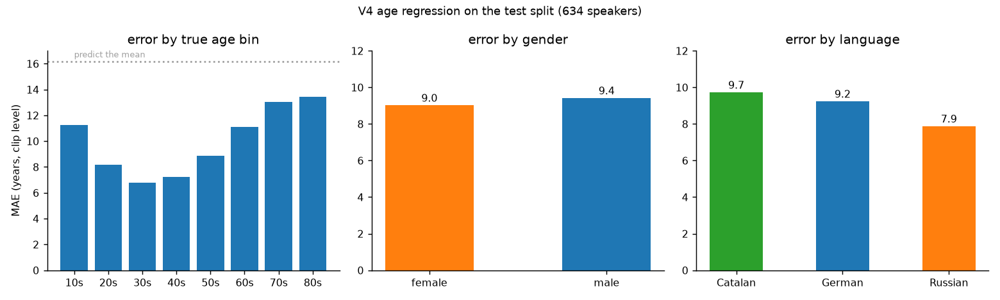
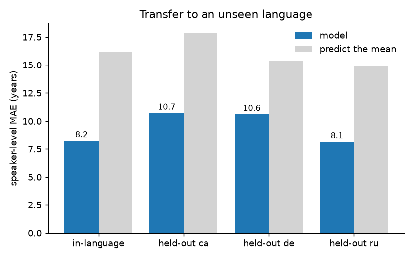
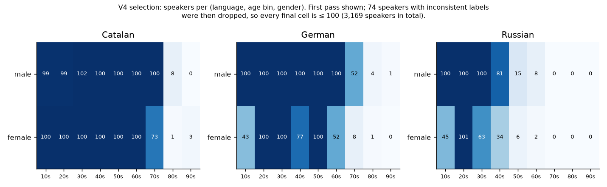

# Voice-Based Age and Gender Estimation Across Languages

Estimate a speaker's age in years and their gender from a short
recording. The model is trained on 3,169 speakers of Catalan, German and
Russian, and it also works on languages it was not trained on.

## Quick start

```bash
pip install -r requirements.txt
python src/predict.py my_clip.wav
```

For each file it prints the length, the estimated age in years, the
probability that the speaker is female, and the resulting gender.

- The trained model is included (`models/eiry.joblib`). The WavLM encoder
  (about 380 MB) downloads on the first run.
- Several files at once: `python src/predict.py a.wav b.mp3 c.flac`.
- Formats: wav, flac, ogg and mp3 work out of the box; m4a and similar
  formats need [ffmpeg](https://ffmpeg.org) installed.
- Ten seconds or more of speech gives the steadiest estimate. Typical age
  error is about 8 years.

## Results

| Task | Test set | Result |
|---|---|---|
| Age, speakers not seen in training | 634 speakers, 3 languages | **8.2 years** MAE, Spearman **0.84** |
| Age, language not seen in training | Catalan, 1,385 speakers | **10.7 years** MAE, Spearman **0.81** |
| Age, language not seen in training | German, 1,138 speakers | **10.6 years** MAE, Spearman **0.77** |
| Gender | Russian speakers ¹ | **0.95** macro-F1 |

Scores are per speaker (the average over a speaker's clips). Always
guessing the average age gives 16 years of error; human listeners are
typically off by about 10 years. All numbers are in
[results/metrics.json](results/metrics.json).

¹ Gender was measured with 5-fold cross-validation on the Russian train
and validation speakers, using the same features. `python src/evaluate.py`
also scores it on the three-language test split.


The model orders speakers by age across the whole range, but the
youngest and oldest are pulled toward the middle. Part of that comes from
the labels: Common Voice only records decade bins, and the target for
"teens" is 16 although most teen speakers are 17 to 19.



Error is similar for women and men (9.0 and 9.4 years per clip) and
across the three languages (7.9 to 9.7).



On a language it has never heard, the model is about 2.5 years less
accurate. Held-out Russian keeps its 8.1-year error, but its rank
correlation is lower (0.57) because nearly all Russian speakers are under
fifty.

## How it works

```
audio ─► 16 kHz, 6-second windows ─► WavLM-base-plus (frozen) ─► layer 5, averaged over time
                                                                      │ 768 numbers
                                                     ┌────────────────┴────────────────┐
                                              ridge regression                logistic regression
                                                age in years                      P(female)
                                                     └───── averaged over windows ─────┘
```

- **Encoder.** `microsoft/wavlm-base-plus` is used as is and never
  retrained. Age information is strongest in its middle layers, so the
  model reads layer 5 of 12 instead of the last layer.
- **Models.** Age: ridge regression on the midpoint of the speaker's age
  bin. Gender: logistic regression. Fine-tuning the whole encoder was
  tried and did not do better.
- **Speakers, not clips.** Every speaker is in exactly one of train,
  validation or test, so scores always come from voices the model has
  never heard.
- **Unseen languages.** Train on two languages, test on every speaker of
  the third, for each language in turn.

## Data

[Mozilla Common Voice 21.0](https://commonvoice.mozilla.org), three
languages:

| Language | Speakers | Clips |
|---|---|---|
| Catalan | 1,385 | 5,392 |
| German | 1,138 | 4,206 |
| Russian | 652 | 2,466 |
| **Total** | **3,169** | **12,064** |

- At most 100 speakers per language, age bin and gender; 4 clips per
  speaker, each cut to 6 seconds.
- Speakers whose age or gender label changes between recordings are
  removed.
- Every age bin appears in every language, so the model cannot infer age
  from the language.
- Ages run from teens to seventies, with 233 to 599 speakers per decade.
  The eighties and nineties have 18 speakers in total and are not
  interpreted.

Why these languages: Catalan is the only large Common Voice corpus
balanced in both gender and age, with the most speakers over fifty.
German adds a second language with older speakers. Russian on its own has
only 31 speakers over fifty; a model trained on it alone kept every
prediction between 25 and 33.



## Train it yourself

```bash
pip install -r requirements.txt

python src/download_data.py      # 1. pick speakers and download their clips (~70 GB transferred, ~2 GB kept)
python src/make_splits.py        # 2. train / val / test split by speaker
python src/extract_features.py   # 3. WavLM features for every clip (a GPU helps)
python src/evaluate.py           # 4. scores on unseen speakers and languages -> results/metrics.json
python src/train.py              # 5. fit on every speaker -> models/eiry.joblib
```

Intermediate files go to `data/`, which is not committed. Every script
has `--help`; for example `download_data.py --langs` takes any Common
Voice language codes.

## Project structure

```
├── models/eiry.joblib        trained age and gender model, loaded by predict.py
├── results/
│   ├── metrics.json          the numbers in this README
│   └── figures/
├── src/
│   ├── predict.py            estimate age and gender for audio files
│   ├── download_data.py      step 1: select speakers, download clips
│   ├── make_splits.py        step 2: train / val / test split by speaker
│   ├── extract_features.py   step 3: audio to WavLM layer-5 features
│   ├── evaluate.py           step 4: scores on unseen speakers and languages
│   ├── train.py              step 5: fit and save the final model
│   └── common.py             shared settings: paths, encoder, layer, age bins
├── requirements.txt
└── LICENSE
```

`scikit-learn` is pinned to 1.6.1, the version that saved
`models/eiry.joblib`; other versions warn when loading it.

## Limitations

- Age labels are self-reported decade bins and the target is the bin
  midpoint, so part of the error is label uncertainty.
- Voice carries age to roughly a decade; finer distinctions are not
  reliable.
- No children: Common Voice has no speakers under 13.
- Tested on three European languages recorded through the Common Voice
  website. Distant languages and other recording conditions are untested.

## License

Code: MIT, see [LICENSE](LICENSE). Data: Mozilla Common Voice, CC0.
Common Voice terms prohibit attempting to identify speakers; this project
estimates age and gender and never identifies anyone.
