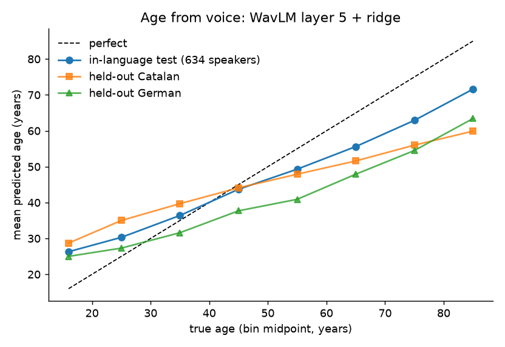

# Voice-Based Age and Gender Estimation Across Languages

Estimating a speaker's age and gender from a few seconds of speech, using
frozen self-supervised speech representations and linear models, trained
on Catalan, German and Russian and tested on languages the model has
never heard.

## Results

| Task | Test set | Result |
|---|---|---|
| Gender | 634 speakers, 3 languages | **0.95** macro-F1 |
| Age, in-language | 634 speakers, 3 languages | **8.2 years** MAE per speaker, Spearman **0.84** |
| Age, unseen language | Catalan held out, 1,385 speakers | **10.7 years** MAE, Spearman **0.81** |
| Age, unseen language | German held out, 1,138 speakers | **10.6 years** MAE, Spearman **0.77** |

Guessing the average age gives 16 years of error. Human listeners are
typically off by about 10 years.



Error is the same for women and men (9.0 / 9.4 years) and across the
three training languages (7.9 to 9.7). The model ranks speakers by age
correctly across the whole range; the very young and very old are pulled
toward the middle, which is the usual regression behaviour and is
partly a labelling artefact (Common Voice teens are mostly 17 to 19).

## Method

**Representation.** Mean-pooled hidden states from a frozen
`microsoft/wavlm-base-plus` encoder. Every layer is probed; age
information peaks in the middle layers (layer 5 of 12) and the last
layer is among the worst. This holds for wav2vec2 and Whisper as well.

**Models.** Age: ridge regression on the age-bin midpoint, reported in
years. Gender: logistic regression. Both on the same 768-d features.
Fine-tuning the encoder was tried and does not beat the frozen probe
(see below).

**Speakers, not clips.** Every split is speaker-disjoint. Selection and
early stopping use a validation split; the test split is scored once.
Reported numbers are per speaker (mean prediction over a speaker's
clips) unless stated.

**Transfer test.** Train on two languages, test on every speaker of the
third, for each language in turn.

## Data

Common Voice 21.0, three languages chosen from a label audit of eight
(`docs/LANGUAGE_AUDIT.md`). Catalan is the only corpus balanced in both
gender and age; German adds diversity; Russian was the original
training language.

| | Speakers | Clips |
|---|---|---|
| Catalan | 1,385 | 5,392 |
| German | 1,138 | 4,206 |
| Russian | 652 | 2,466 |
| Total | 3,169 | 12,064 |

At most 100 speakers per language, age bin and gender; 4 clips per
speaker; clips truncated to 6 s; speakers whose labels change between
recordings are dropped. Ages span teens to seventies with 233 to 599
speakers per decade (eighties and nineties have 18 speakers in total
and are not interpreted). Only the selected clips are downloaded,
shard by shard.

## What did not work, and why

The project went through four iterations. The failures are documented
in `docs/EXPERIMENT_LOG.md`; the short version:

| Iteration | Setup | Result | Lesson |
|---|---|---|---|
| V1 | Russian only, 4 decade classes, ECAPA embeddings + logistic regression | 0.36 macro-F1 | Age is decodable but decade bins are too fine |
| V1 | wav2vec2-base fine-tuning, default head | 0.16, collapsed to majority class | Last-layer pooling + shared learning rate + class prior |
| V2 | Layer-wise probes, wav2vec2 / WavLM / Whisper; fixed fine-tuning recipe | 0.33 to 0.39 for every backbone and regime | The ceiling is in the data, not the model |
| V3 | Coarse 3-class (young / adult / older) | older class F1 0.00: 31 speakers over fifty | Russian has no age tails |
| V3 | Age regression, Russian only | 5.7 years MAE but predictions squeezed into 25 to 33 | Same cause |
| V4 | Catalan + German + Russian, balanced | 8.2 years MAE, full range, transfers to unseen languages | Fix the data first |

## Reproduce

```bash
pip install -r requirements.txt

# 1. metadata + audio (shard by shard, ~70 GB transferred, ~2 GB kept)
python src/data_prep.py --langs ca,de,ru

# 2. speaker split, decoded-audio cache, per-layer features
python src/make_splits.py --csv all_age.csv --out splits_v4.csv
python src/cache_audio.py --splits splits_v4.csv
python src/extract_layers.py --model microsoft/wavlm-base-plus --splits splits_v4.csv

# 3. age regression: per-layer CV, test split, then leave-one-language-out
python src/regress_age.py --features layers_wavlm-base-plus.npy --splits splits_v4.csv
python src/regress_age.py --features layers_wavlm-base-plus.npy --splits splits_v4.csv --holdout-lang all --layer 5

# 4. classification probes (age schemes: fine4 / coarse3 / coarse3_gap; gender always)
python src/probe_layers.py --features layers_wavlm-base-plus.npy --splits splits_v4.csv --scheme fine4
```

Steps 2 and 3 take about 20 minutes on a T4. Step 1 is dominated by
the download. The V1 pipeline (`extract_embeddings.py`,
`train_baseline.py`) and the fine-tuning script (`finetune.py`) are
kept for the earlier experiments.

## Repository structure

| Path | Contents |
|---|---|
| `src/data_prep.py` | Balanced speaker selection and shard-wise audio download for any set of languages |
| `src/audit_languages.py` | Speaker counts per age bin and gender for a language, from the remote label tables |
| `src/make_splits.py` | Speaker-disjoint train / val / test split |
| `src/cache_audio.py` | Decode clips once to a cache |
| `src/extract_layers.py` | Mean-pooled hidden states from every layer of wav2vec2 / WavLM / Whisper |
| `src/regress_age.py` | Age regression: per-layer CV, test-split metrics, leave-one-language-out |
| `src/probe_layers.py` | Per-layer classification probes with gender-stratified and test-split reports |
| `src/finetune.py` | Two-stage fine-tuning with class-weighted loss (V2) |
| `src/extract_embeddings.py`, `src/train_baseline.py` | ECAPA baseline (V1) |
| `src/eval_adyghe.py` | Pre-registered evaluation for a low-resource target language (not run, see below) |
| `src/common.py` | Age schemes, regression targets, loaders |
| `notebooks/` | Colab run of the V2 experiments with outputs |
| `results/v1` … `results/v4` | Metrics as JSON for every experiment |
| `results/figures/` | Probe curves, loss curves, age-by-bin and transfer plots |
| `docs/EXPERIMENT_LOG.md` | Every run, including failed ones, with diagnosis |
| `docs/LANGUAGE_AUDIT.md` | Label counts per language and the data decision |

## Limitations

- Age labels are self-reported decade bins; the regression target is
  the bin midpoint, so part of the reported error is label uncertainty.
- Voice carries age at roughly a decade of resolution. Classification
  into bins narrower than that fails at the bin borders.
- No children: Common Voice has no speakers under 13, and the `teens`
  bin cannot be split.
- Transfer was measured on three European languages. Behaviour on
  typologically distant languages or on different recording conditions
  is untested.
- Frozen features and linear models only; no end-to-end training.

## Future work

The original target was Adyghe (West Circassian), an endangered
Northwest Caucasian language with 168 speakers in Common Voice 26.0.
It cannot serve as training data (one male speaker, age labels
female-only) and its audio is not on any public mirror. The evaluation
protocol is pre-registered in the experiment log and implemented in
`src/eval_adyghe.py`: zero-shot error with bootstrap intervals and a
permutation test, few-shot linear calibration, a within-language
reference and a gender specificity check.

## License and terms

Data: Mozilla Common Voice, CC0. Common Voice terms prohibit attempting
to determine speaker identity; this project estimates demographic
attributes and never identifies speakers.
